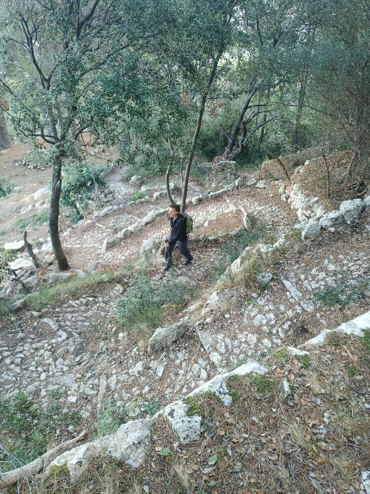

*Strolling through Sòller*

## Easy Hiking

*   Just arrived on the island and want to explore charming places?
*   Have someone to surprise?
*   Have you been on the island for years and have run out of new hiking trails?

Talk to your friends, let's go hiking!

* * *

### Activity Details: 
👥 Group Size: 4 people (optionally up to 20 people)

⏳ Approximate Duration: 4-5 hours, a morning or an afternoon (extendable)

*	📅 We'll agree on the date that suits you best
*	🎒 I'll inform you of the necessary equipment
*	🅿️ I'll send you the location of the parking where we'll meet

### Examples: 
Comuna de Bunyola, Camí des Correu, surroundings of Lluc, Deia-Sóller area, Escoltes, Arxiduc, Biniaraix, Talaia de Alcudia, simple peaks

