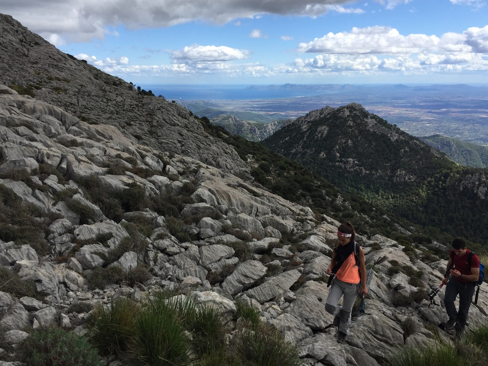

*Technical terrain at Massanella*

## Technical Hiking

An activity for experienced hikers. People who enjoy walking through oak forests, among carritx and the rocky peaks of the island. But maybe you don't feel comfortable with maps, narrow trails, or when you can't find the next cairn. I'd love to guide you on your next hike!

Do you want to hike up to all the peaks of Mallorca!?

* * *

### Activity Details: 
👥 Group Size: 4 people (optionally up to 10 people)

⏳ Approximate Duration: 5-7 hours, quite variable (extendable)

*	📅 We'll agree on the date that suits you best
*	🎒 I'll inform you of the necessary equipment
*	🅿️ I'll send you the location of the parking where we'll meet

### Examples: 
Torrent de Pareis, technical peaks (Galatzó, Massanella, Tomir...)

