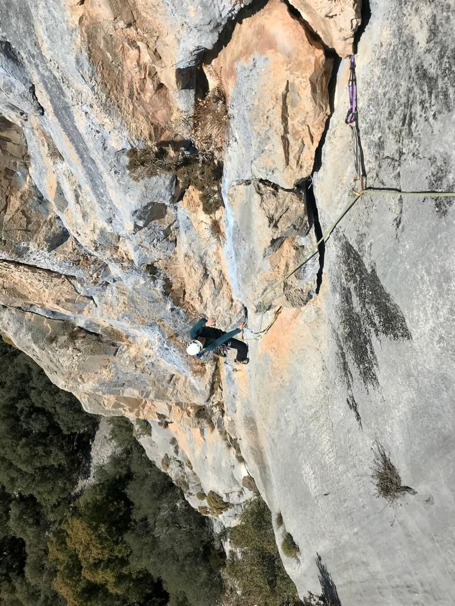

*Cracks are perfect placements*

## Trad Multipitch
Mountaineers are great nature lovers and we try to enjoy it without disturbing its balance, leaving as little trace as possible.

I invite you to climb a rock face where we'll find just a few anchors to catch a breath and enjoy the views. I'll protect the rest of the route with gear that you'll be collecting to leave the rock just as we found it!

Will you join me?

* * *

### Activity Details: 
👥 Group Size: 1 person (optionally 2 people)

⏳ Approximate Duration: 5-7 hours, quite variable

*	📅 We'll agree on the date that suits you best
*	🎒 I'll inform you of the necessary equipment
*	🅿️ I'll send you the location of the parking where we'll meet

### Examples: 
Albahida, Esperó des Plà, Agulla des Frare, Pepe Ramón

