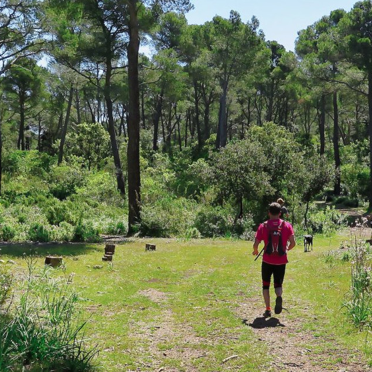

*Enjoyable training!*

## Trail Running

Going for a run in the mountains is not crazy; routes, distances, and elevations can be adapted. Perhaps you've been walking in the Tramuntana mountains for years, watching runners enjoy trotting along the trails, and now it's your turn...

...to lace up your running shoes! 🏃🏻

* * *

### Activity Details: 
👥 Group Size: 1 person (optionally 2 people)

⏳ Approximate Duration: 1-2 hours (extendable)

*	📅 We'll agree on the date that suits you best
*	🎒 I'll inform you of the necessary equipment
*	🅿️ I'll send you the location of the parking where we'll meet

### Examples: 
Comuna de Bunyola, Esporles, Cases de Galatzó, Cúber area...

