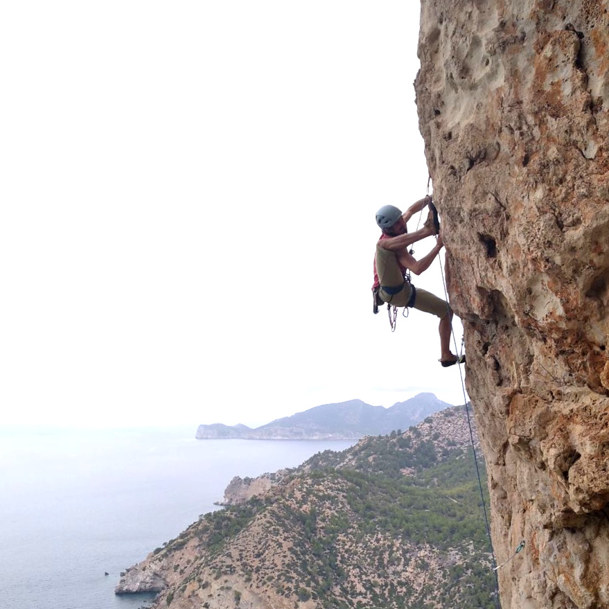

## Senderismo técnico

Una actividad para senderistas habituales. Gente que disfruta de caminar por encinares, entre carritx y los penyales de la isla. Pero quizá no te sientes cómodo/a con los mapas, los senderos estrechos, cuando no encuentras la siguiente fita o marca de la ruta. Me encantará acompañarte en tu próxima excursión!

¿Quieres subir caminando a todos los miles de Mallorca!?

* * *
Ejemplos: 
Torrent de Pareis, picos técnicos (Galatzó, Massanella, Tomir…)
