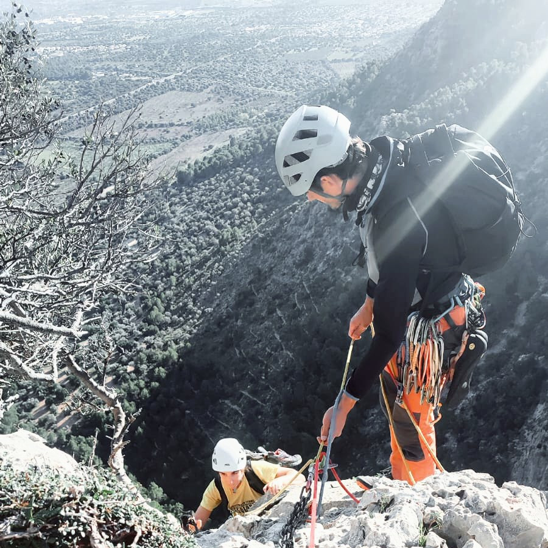

## Vía larga
¡La aventura con mayúsculas!

Los grandes itinerarios en roca son la actividad más exclusiva que se puede hacer en montaña: 1 cliente y 1 guía unidos por la cuerda.

Ofrecemos desde trepadas por crestas hasta escaladas verticales ascendiendo a cumbres que a menudo son solo accesibles escalando.

Sin duda, ¡un lujo al alcance de unos pocos!

* * *
[back](./)
