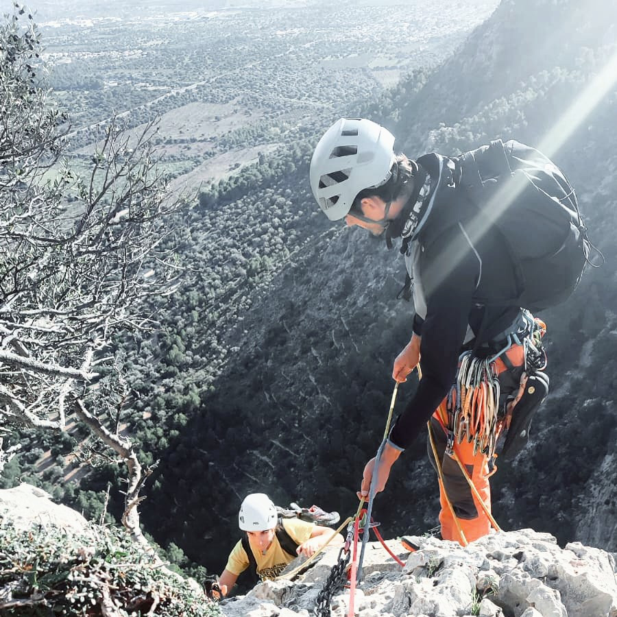

## Vía larga clásica
Los montañeros somos grandes amantes de la naturaleza e intentamos disfrutar de ella sin perturbar su equilibrio, dejando el mínimo rastro posible.

Te invito a escalar una pared de roca en la que apenas encontraremos unos pocos anclajes donde tomar un respiro y disfrutar de las vistas. El resto del recorrido lo protegeré con protecciones que tú irás recogiendo para dejar la roca tal y como la encontramos!

¿Me acompañas?

* * *
Ejemplos: 
Albahida, Esperó des Plà, Agulla des Frare, Pepe Ramón, Rectal
